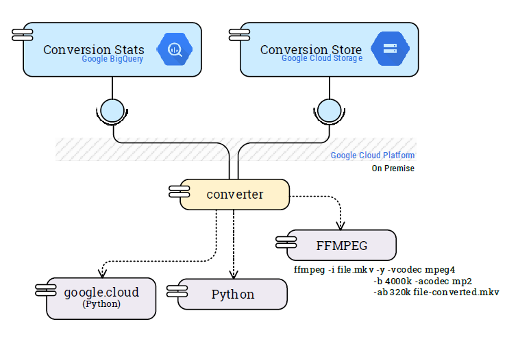

# Video Conversion

This program is inspired from [Video Converter](https://github.com/esuau/video-converter).



This program converts a video file to MKV and uploads it to a Google Cloud Storage bucket. Then, it saves conversion statistics on BigQuery.

## Requirements

### Credentials

**Google Cloud**

The credentials are stored in a .json file. The environment variable GOOGLE_APPLICATION_CREDENTIALS defines the location of this file on your computer. You can set it as follows:

```bash
export GOOGLE_APPLICATION_CREDENTIALS=<path_to_service_account_file>
```

### Dependencies

**Python dependencies**

Install required dependencies with the following command:
pip install -r requirements.txt

**FFmpeg**

The converter uses FFmpeg to perform media file conversion. Please [download it](https://www.ffmpeg.org/download.html) and add the executable to your `PATH` variable.

## Execution

If every requirement is completed, you can run the project as shown below:

```bash
python conversion_worker.py
```